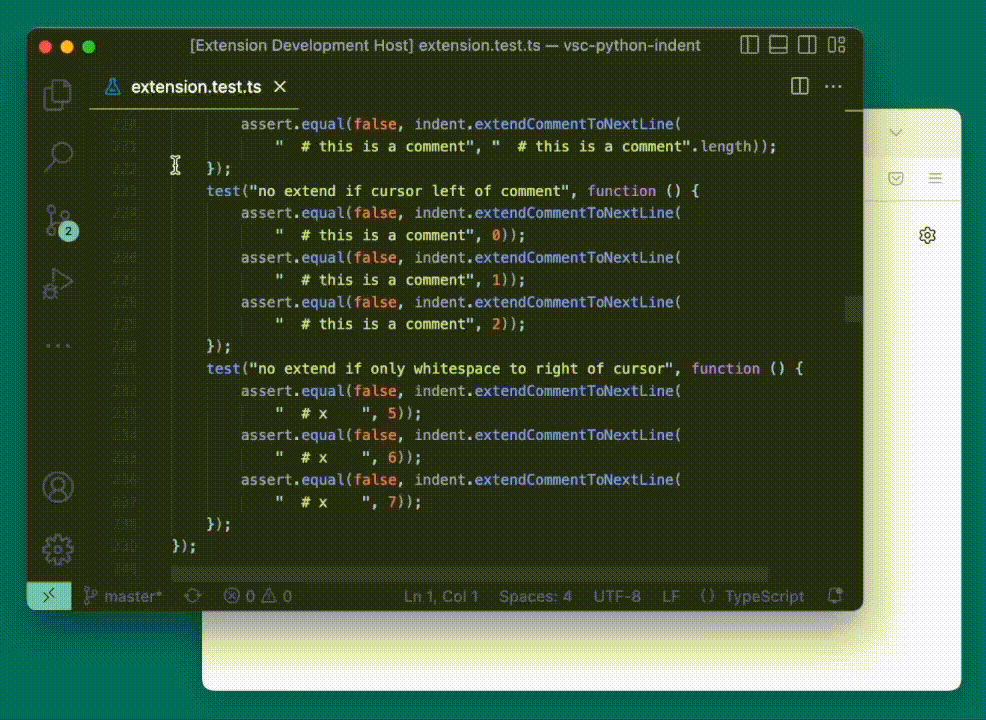

# VSCode Line Link

Open a link to your exact line of code in a browser. Compatible with GitHub and GitLab.

This extension is immature, and will have many bugs.

## Features

* Open command pallete (`cmd`/`ctrl` + `shift` + `p`) and type either "Copy Link to Code" or "Open in browser".
* Set keyboard shortcuts for `line-link.copyLink` or `line-link.openLink` if you want easier access.

## Requirements

Your workspace must be a valid git repository.

Only GitHub and GitLab have been tested. Other git providers will not work unless they share the same URL structure.

## How?

Inspects and parses `git remote` to find the URL of the project.

## Release Notes

See [CHANGELOG.md](./CHANGELOG.md).

## License

Available under the MIT license, see [LICENSE.txt](./LICENSE.txt) for details.

Code located at `/src/typings/git.d.ts` comes from the [VSCode repo](https://github.com/Microsoft/vscode/) and is also available under the MIT license.
